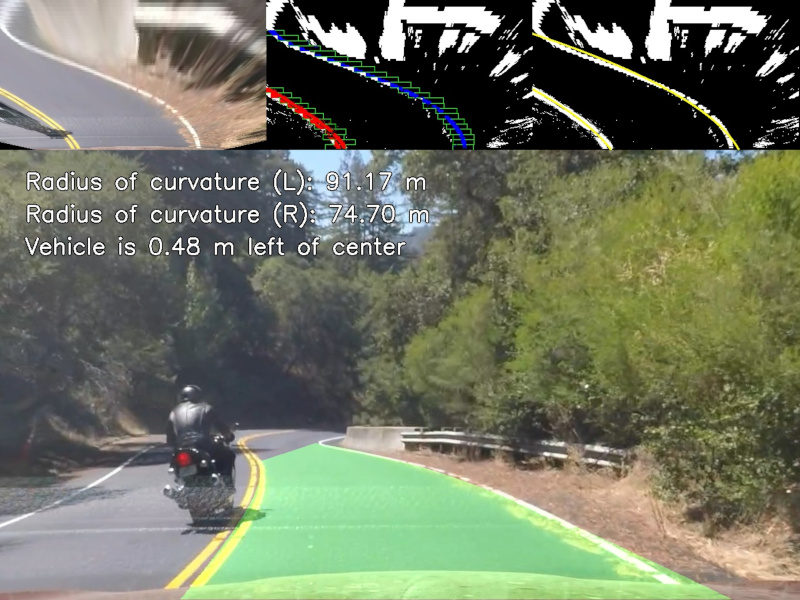
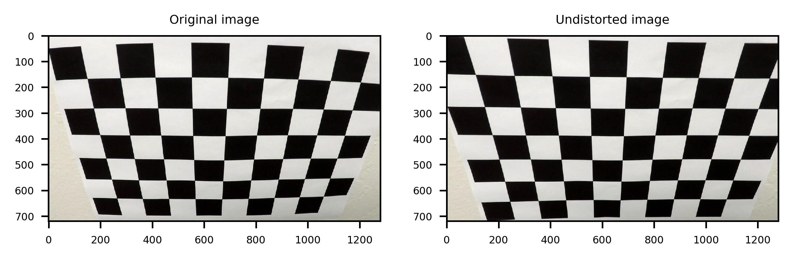
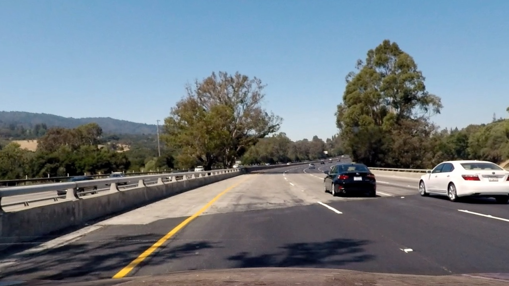
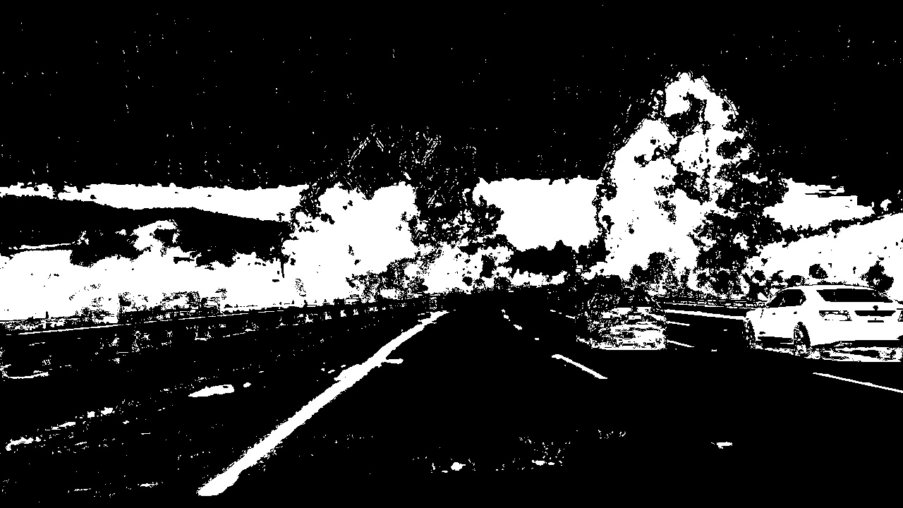
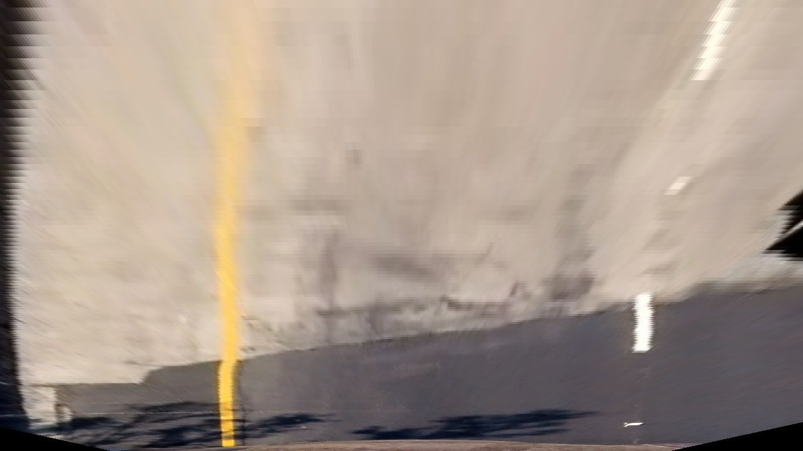
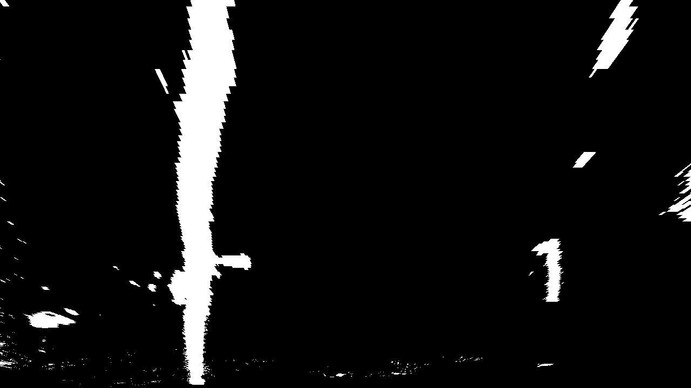
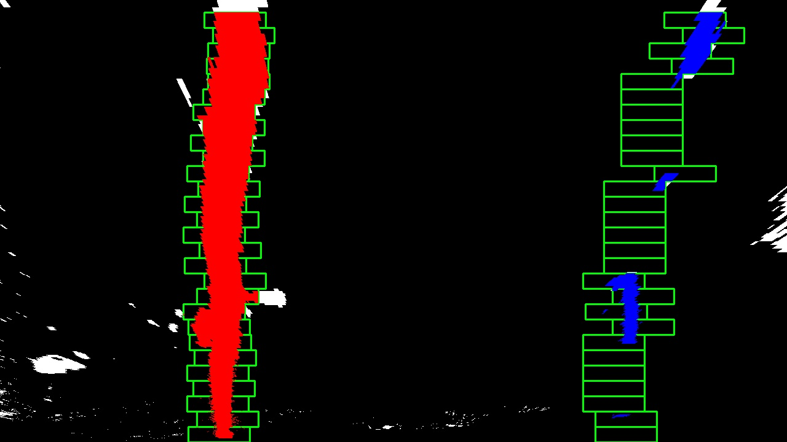
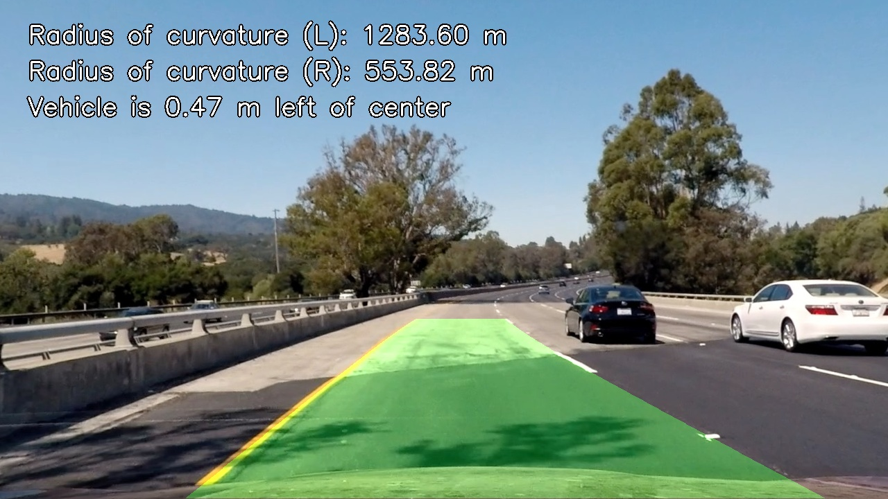

# **Advanced Lane Finding Project**
[](http://www.udacity.com/drive)

The goal of this project is to write a software pipeline to identify lane
boundaries in videos.



## Usage

To calibrate camera with chessboard pattern _(note, this repository already
includes [camera calibration data](./camera.json) for test videos)_:

`./camera_cal.py -i camera_cal -x 9 -y 6 camera.json`

To test camera calibration:

`./camera_test.py camera_cal/calibration2.jpg`

To detect lines on test images:

`./find_lane_lines.py test_images -o output_images`

To detect lines on project video:

`./find_lane_lines.py test_videos/project_video.mp4 -o output_videos/project_video.mp4`

## [Rubric](https://review.udacity.com/#!/rubrics/571/view) Points

### Here I will consider the rubric points individually and describe how I addressed each point in my implementation.

---

### Writeup / README

#### 1. Provide a Writeup / README that includes all the rubric points and how you addressed each one.  You can submit your writeup as markdown or pdf.  [Here](https://github.com/udacity/CarND-Advanced-Lane-Lines/blob/master/writeup_template.md) is a template writeup for this project you can use as a guide and a starting point.

You're reading it!

### Camera Calibration

#### 1. Briefly state how you computed the camera matrix and distortion coefficients. Provide an example of a distortion corrected calibration image.

The code for this step is contained in the function `calibrate_camera()` at
[camera_cal.py](./camera_cal.py#L9).

I start by preparing "object points", which will be the (x, y, z) coordinates of
the chessboard corners in the world. Here I am assuming the chessboard is fixed
on the (x, y) plane at z=0, such that the object points are the same for each
calibration image.  Thus, `objp` is just a replicated array of coordinates, and
`objpoints` will be appended with a copy of it every time I successfully detect
all chessboard corners in a test image.  `imgpoints` will be appended with the
(x, y) pixel position of each of the corners in the image plane with each
successful chessboard detection.

I then used the output `objpoints` and `imgpoints` to compute the camera
calibration and distortion coefficients using the `cv2.calibrateCamera()`
function.  I applied this distortion correction to a test image using the
`cv2.undistort()` function and obtained this result:



### Pipeline (single images)

#### 1. Provide an example of a distortion-corrected image.



#### 2. Describe how (and identify where in your code) you used color transforms, gradients or other methods to create a thresholded binary image.  Provide an example of a binary image result.

The code for this step is contained in the method `_select_pixels()` of
`LaneFinder` class at [find_lane_lines.py](./find_lane_lines.py#L386).

First, I passed the input image through a bilateral filter intending to reduce
noise while keeping edges reasonably sharp. Then, I extracted individual channels
from the image representation in RGB, HLS, and CIELAB color spaces.

Next, I attempted to assess the lightness distribution of the image, so I could
later apply some thresholds conditionally. To do so, I introduced two boolean
measures, `too_bright` and `much_light`. The former indicates if the image
appears overexposed, whereas the latter indicates if the image has a lot of
light overall but is not necessarily overexposed.

In order to evaluate `too_bright`, I calculated a 5-bin histogram of lower 1/3
region of HLS L channel. Then, I determined if the brightest histogram bin is
the biggest one:
```python
too_bright = np.argmax(hist_sm) == hist_sm.shape[0]-1
```

As for `much_light`, I calculated same histogram but with more bins (10). Then
I multiplied histogram bins by exponential weights and compared their sum to a
threshold:
```python
light_level = np.sum(np.multiply(hist_big.reshape(-1), np.exp(np.arange(hist_big.shape[0]))))
much_light = light_level >= 400
```

Finally, I combined the following binary masks with bitwise OR:
- White color threshold on HLS-L channel, if the image is not overexposed nor
    particularly light.
- White color threshold on CIELAB-L channel, if the image is not overexposed but
    is rather light.
- Yellow color threshold on HLS channels.
- Yellow color threshold on the histogram-equalized CIELAB-b channel.
- RGB R channel threshold, if the image is not too light.
- Saturation threshold (HLS-S channel), if the image is not overexposed.
- Gradient & magnitude threshold on the histogram-equalized HLS-S channel.
    Parameters vary depending on the lightness measures (the idea is to
    compensate for left out white color thresholds on overexposed images).

Here's an example of my output for this step:



#### 3. Describe how (and identify where in your code) you performed a perspective transform and provide an example of a transformed image.

I applied a bird's eye perspective transformation to the image mask in
`LaneFinder._prepare_job()` to make curve fitting more straightforward. I also
used inverse perspective transformation in `LaneFinder._render_resul()` to
project lane area back onto source image.

I implemented perspective transforms through methods `Camera.warp()` and
`Camera.unwarp()` at [find_lane_lines.py](./find_lane_lines.py#L41). There, I
used `cv2.warpPerspective()` with the transformation matrix calculated by
`cv2.getPerspectiveTransform()` from fixed source and destination quadrangle
vertices. For inverse perspective transformation, I inverted the matrix using
`numpy.linalg.inv()`.

I chose to copy the hardcoded source and destination points from the writeup
template in the following manner:

```python
src = np.float32([
    [width/2-55,   height/2+100],
    [width/6-10,   height],
    [width*5/6+60, height],
    [width/2+55,   height/2+100]
])
dst = np.float32([
    [width/4,   0],
    [width/4,   height],
    [width*3/4, height],
    [width*3/4, 0]
])
```

An example of perspective-transformed image:



An example of perspective-transformed mask:



#### 4. Describe how (and identify where in your code) you identified lane-line pixels and fit their positions with a polynomial?

See `find_lane_pixels()`, `search_around_poly()` and `Line.fit()` at
[find_lane_lines.py](./find_lane_lines.py#L92).

`find_lane_pixels()` finds lane pixels on a mask using sliding window starting,
by default, from histogram peaks. Here is how my implementation differs
from example implementation presented with the course:

- The histogram is calculated over the lower 1/3 region of the mask.
- Search loop stops if the window reaches the border of the mask.
- Search loop stops if there were too many consecutive empty windows.
- Nonzero indices from windows with few pixels are discarded.
- Next window position change is amplified.
- If line bases are too close, one line is discarded right away.

`search_around_poly()` is helpful on videos. It searches for lane pixels around
polynomials of previously established lines. If the number of nearby pixels if
below a certain threshold, it considers them all part of lane lines. Otherwise,
it masks out any other pixels and resorts to `find_lane_pixels()`.

At `Line.fit()`, I used `numpy.polyfit()` to fit newly found lane-line pixels
with a polynomial.

Here's a visualization of my sliding window search:



#### 5. Describe how (and identify where in your code) you calculated the radius of curvature of the lane and the position of the vehicle with respect to center.

The distance from vehicle center to a single line and its radius of curvature
in meters are recalculated upon every update of polynomial coefficients in
`Line._update_best()` at [find_lane_lines.py](./find_lane_lines.py#L277).

Vehicle offset from the lane center is calculated as the difference of each
line's distances in `LaneFinder._process_job()` at
[find_lane_lines.py](./find_lane_lines.py#L535).

To translate pixel distances to real-world distances, I defined
meters per pixel ratios for _x_ and _y_ dimensions of bird's eye image:
```python
mx = 3.7/700
my = 30/720
```

I calculated radius of curvature in meters as follows (here, `A` and `B` are
polynomial coefficients, and `y0` is the height of image):
```python
A *= (mx / (my ** 2))
B *= (mx / my)
y0 *= my
R_curve = (1 + (2*A*y0+B)**2)**(3/2) / np.absolute(2*A)
```

I calculated the distance from the line to vehicle center like this (`x0` is
the polynomial value at `y0`):
```python
center_dist = np.absolute(x0 - center_x) * mx
```

#### 6. Provide an example image of your result plotted back down onto the road such that the lane area is identified clearly.



### Pipeline (video)

#### 1. Provide a link to your final video output.  Your pipeline should perform reasonably well on the entire project video (wobbly lines are ok but no catastrophic failures that would cause the car to drive off the road!).

Here are the video results along with command line arguments to replicate them.

#### [Project video output](./output_videos/project_video.mp4)
`./find_lane_lines.py test_videos/project_video.mp4 -o output_videos --trace`

#### [Challenge video output](./output_videos/challenge_video.mp4)
`./find_lane_lines.py test_videos/challenge_video.mp4 -o output_videos --trace`

#### [Harder challenge video output](./output_videos/harder_challenge_video.mp4)
`./find_lane_lines.py test_videos/harder_challenge_video.mp4 -o output_videos --trace --curvy-roads`

### Discussion

#### 1. Briefly discuss any problems / issues you faced in your implementation of this project.  Where will your pipeline likely fail?  What could you do to make it more robust?

Detecting white lines turned out to be more troublesome than detecting yellow
lines.

Histogram peaks did not work very well for identifying base coordinates of
highly inclined lines.

The current implementation will likely fail spectacularly on most videos with
conditions slightly different from conditions in test videos, e.g. underexposed
images, images with wrong white balance, night, heavy traffic, construction
signs, rain, snow, fog, different lane markings, road junctions, reflective
puddles, wet roads, fallen leaves etc.

One way to improve lane pixel selection under different conditions might be to
use another combination of binary masks targeting what is _not_ part of a lane
line and then excluding these pixels from the lane line mask. Although
perspective transformation effectively cuts off most of the surroundings, it's
not always the case, especially during sharp turns such as in harder challenge
video.

Another possible improvement would be to detect when the vehicle enters a sharp
turn and then make use of this knowledge when seeking the lines.

A fundamentally different approach might be required to get significantly better
results, one that considers the semantics of image contents. After all, being
part of a lane line is not a property of a pixel; what matters is the big
picture. A convolutional neural network might be an excellent foundation for
such an approach. It would probably be superior in terms of robustness,
flexibility, performance, and maintainability. Compared to this, the only
advantage of using computer vision techniques alone I can think of is that it
does not require large dataset for training.
